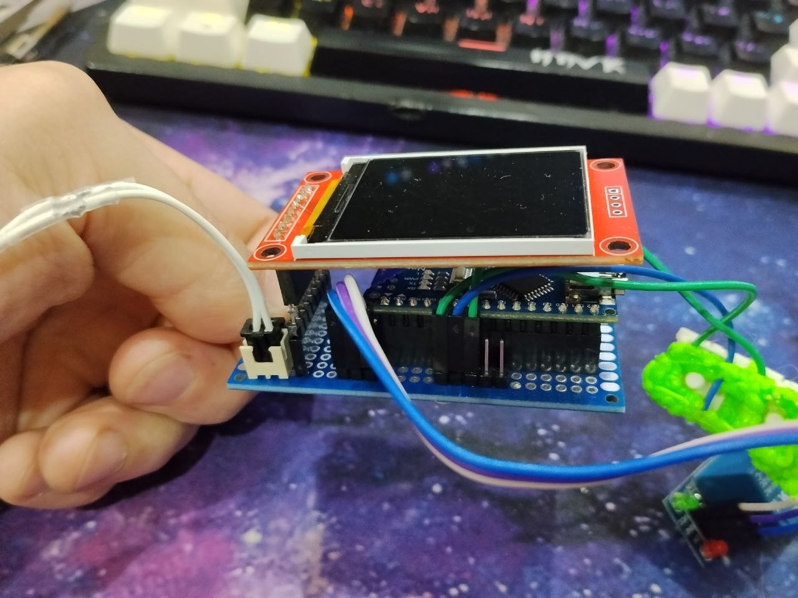
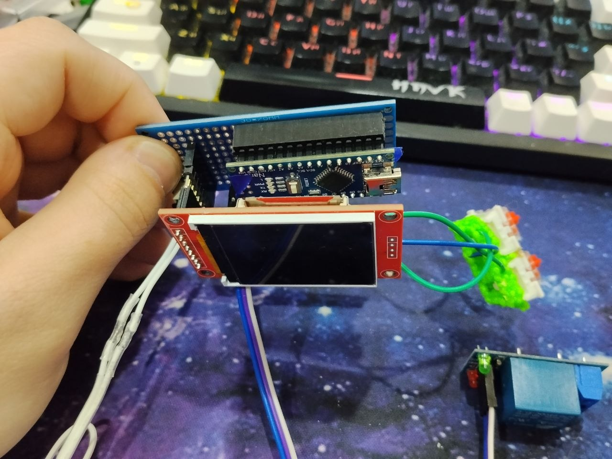

# Arduino Nano temperature controller




## Using

1.8 TFT
Arduino Nano
5v relay module

```cpp

// Thermistor settings
#define THERMISTOR_PIN A1        // Analog pin connected to the thermistor
#define SERIESRESISTOR 100000    // Series resistor value (100k ohms)
#define THERMISTORNOMINAL 100000 // Nominal resistance of thermistor at 25°C (100k ohms)
#define TEMPERATURENOMINAL 25    // Nominal temperature for thermistor (25°C)
#define BCOEFFICIENT 3950        // B-coefficient of the thermistor (3950K)
#define NUMSAMPLES 10            // Number of samples for averaging
#define GLOBAL_TEXT_SIZE 1.7     // Global text size for display
#define POSXDEF 5                // Default X position for text output

// Button pins for setting target temperature
#define BTN_UP 2   // Button to increase target temperature
#define BTN_DOWN 4 // Button to decrease target temperature

// Relay module pins
#define RELAY1 7 // Relay control pin (heater)

// Additional parameters
#define APPEND_VALUE 10        // Temperature change step when button is pressed
#define TEMPERATURE_UPDATE 0.2 // Temperature reading update interval (seconds)

```
